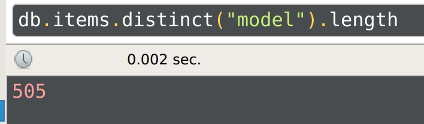
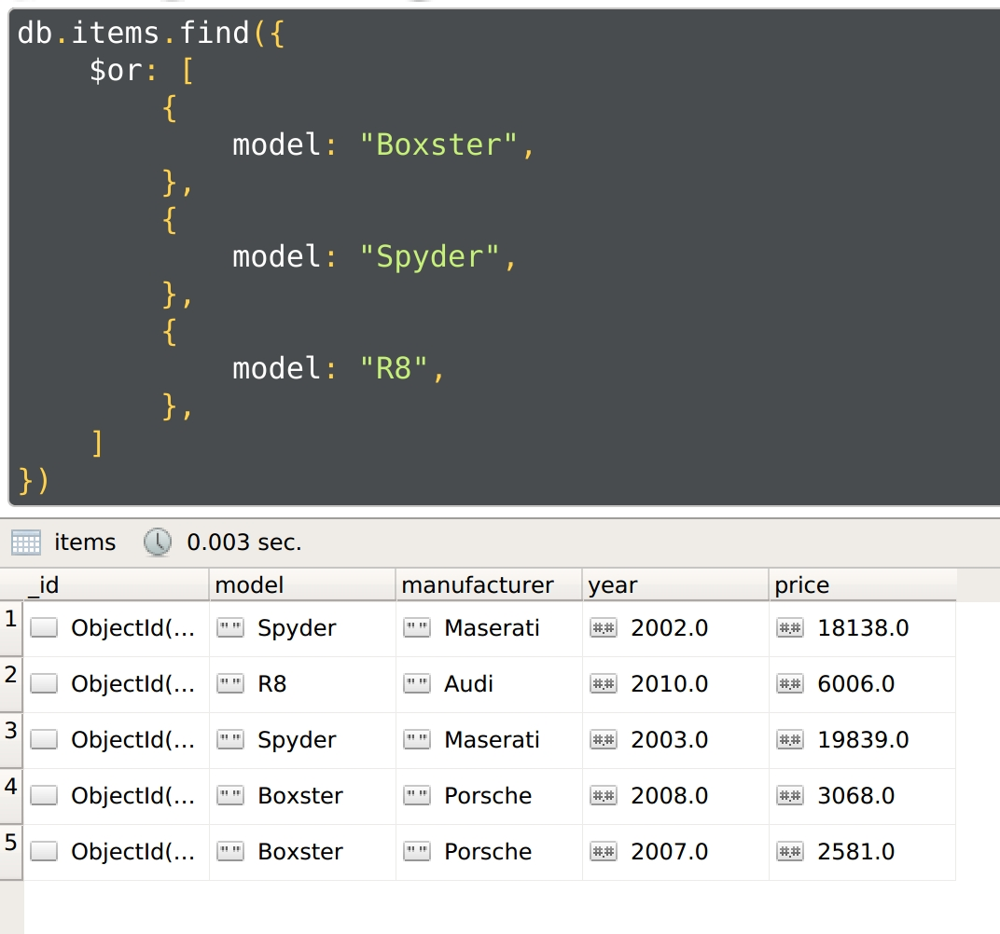

## 1

### Завдання 1.2

Напишіть запит, який виводіть усі товари (відображення у JSON)

```js
db.items.find({})
```


### Завдання 1.3

Підрахуйте скільки товарів у певної категорії

```js
db.items.count({
    model: "Boxster",
})
```


### Завдання 1.4

Підрахуйте скільки є різних категорій товарів

```js
db.items.distinct("model").length
```



### Завдання 1.5

Виведіть список всіх виробників товарів без повторів

```js
db.items.distinct("manufacturer")
```


### Завдання 1.6

Напишіть запити, які вибирають товари за різними критеріям і їх сукупності:

#### Завдання 1.6.1

категорія та ціна (в проміжку) - конструкція $and

```js
db.items.find({
    manufacturer: "Porsche",
    $and: [{
        price: {
            $gt: 10000,
            $lt: 15000,
        }
    }]
})
```


#### Завдання 1.6.2

модель чи одна чи інша - конструкція $or

```js
db.items.find({
    $or: [
        {
            model: "Boxster",
        },
        {
            model: "Spyder",
        },
        {
            model: "R8",
        },
    ]
})
```



#### Завдання 1.6.3

виробники з переліку - конструкція $in

```js
db.items.find({
    manufacturer: {
        $in: ["Jaguar", "Maybach", "Land Rover"]
    }
})
```


#### Завдання 1.7

Оновить певні товари, змінивши існуючі значення і додайте нові властивості (характеристики) усім товарам за певним критерієм

```js
db.items.update(
   { model: "Boxster" },
   { $set: {
       price_new: 120000,
       model: "Boxster S",
     }
   },
   { multi: true }
)
```


#### Завдання 1.8

Знайдіть товари у яких є (присутнє поле) певні властивості

```js
db.items.find({
    price_new: {
        $exists: true,
    },
})
```


#### Завдання 1.9

Для знайдених товарів збільшіть їх вартість на певну суму

```js
db.items.update(
    {
        price_new: {
            $exists: true,
        },
    },
    { $inc: { price: 1000 } },
    { multi: true }
)
```


## 2

### Завдання 2.3

Виведіть замовлення з вартістю більше певного значення

```js
db.orders.find({
    total_sum: {$gt: 30000},
})
```


### Завдання 2.4

Знайдіть замовлення зроблені одним замовником

```js
db.orders.find({
   "customer.first_name": "James",
   "customer.last_name": "Hetfield",
})
```


### Завдання 2.5

Знайдіть всі замовлення з певним товаром (товарами) (шукати можна по ObjectId)

```js
db.orders.find({
    "items.$id": {
        $in: [ObjectId("603e36084d43dda4515327d6"), ObjectId("603e36084d43dda4515329ea")],
    }
})
```


### Завдання 2.6

Додайте в усі замовлення з певним товаром ще один товар і збільште існуючу вартість замовлення на деяке значення Х

```js
db.orders.update(
    {
        items: DBRef("items", ObjectId("603e77477666892940d9ba87")),
    },
    {
        $push: {items: DBRef("items", ObjectId("603e77477666892940d9b72d"))},
        $inc: {total_sum: 7285},
    },
    { multi: true }
)
```


### Завдання 2.7

Виведіть кількість товарів в певному замовленні

```js
db.orders.aggregate([
    {
        $match: {_id: ObjectId("603e3609ceb7a13a9952b35f")},
    },
    {
        $project:{
            _id: 0,
            count: { $size: "$items" }
        }
    }
])
```


### Завдання 2.8

Виведіть тільки інформацію про кастомера і номери кредитної карт, для замовлень вартість яких перевищує певну суму

```js
db.orders.find({
    total_sum: {$gt: 30000},
}, {
    _id: 0,
    customer: 1,
    "payment.card_id": 1,
})
```


### Завдання 2.9

Видаліть товар з замовлень, зроблених за певний період дат

```js
db.orders.update({
    date: {
        $gt: new Date("2017-03-01"),
        $lt: new Date("2018-01-01"),
    },
}, {
    $pop: { items: 1 }
})
```


### Завдання 2.10

Перейменуйте у всіх замовлення ім'я (прізвище) замовника

```js
db.orders.update({
   "customer.first_name": "Kirk",
   "customer.last_name": "Hammett",
}, {
    $set: {
        "customer.first_name": "David",
        "customer.last_name": "Mustaine",
    },
}, {
    multi: true,
})
```


### Завдання 2.11

Знайдіть замовлення зроблені одним замовником, і виведіть тільки інформацію про кастомера та товари у замовлені підставивши замість ObjectId("***") назви товарів та їх вартість (аналог join-а між таблицями orders та items)

```js
db.orders.aggregate([
    {
        $match: {
            "customer.first_name": "James",
            "customer.last_name": "Hetfield",
        }
    }, {
        $lookup: {
            from: "items",
            localField: "items.$id",
            foreignField: "_id",
            as: "items",
        }
   }, {
       $project: {
           _id: 0,
           customer: 1,
           items: {
               model: 1,
               manufacturer: 1,
               price: 1,
           },
       }
   }
])
```


## 3

### Завдання 3.1

```js
db.reviews.find({})
```


### Завдання 3.2

```js
db.reviews.insert({
    "name": "Владимир",
    "text": "бонус - наявність футляра для транспортування і зберігання всіх предметів, включаючи дрібні, в спеціальних карманчиках.",
})
```


### Завдання 3.3

```js
db.reviews.find({})
```


